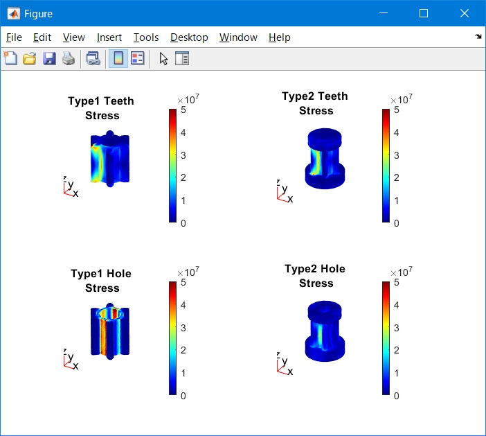

# FEM Structual Analysis of Pinion Gear in MATLAB

Sample code to analysis 6T pinion gear.
## Requirement
- MATLAB 2021a or later
- Partial Differential Equation Toolbox

## MATLAB command to download and open the demo (MATLAB live script)
``` MATLAB
mkdir('./fem_demo');
cd('./fem_demo');
websave('FEMAnalysisPinionGear.mlx','https://github.com/covao/FEM_PinionGear_MATLAB/raw/main/FEMAnalysisPinionGear.mlx');
websave('pinion_gear_6t_1.stl','https://github.com/covao/FEM_PinionGear_MATLAB/raw/main/pinion_gear_6t_1.stl');
websave('pinion_gear_6t_2.stl','https://github.com/covao/FEM_PinionGear_MATLAB/raw/main/pinion_gear_6t_2.stl');
open('FEMAnalysisPinionGear.mlx');

```

  

